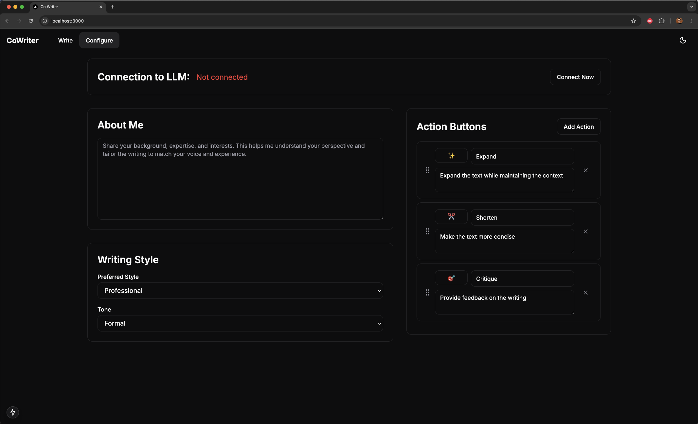

# CoWriter

CoWriter is an AI-powered writing assistant that helps you improve your writing through various actions like expanding, shortening, and critiquing text. It provides an intuitive interface for real-time writing enhancement.

## Screenshots

### Writing Interface

*The main writing interface where you can edit text and apply various AI-powered actions*

### Configuration

*Configure your AI model settings and preferences*

## Features

- **Text Expansion**: Elaborate on your ideas with AI-powered suggestions
- **Text Shortening**: Make your writing more concise and impactful
- **Writing Critique**: Get constructive feedback on your writing
- **Interactive Chat**: Engage in a conversation about your text
- **Modern UI**: Clean and intuitive interface built with Next.js
- **Flexible AI Backend**: Support for both OpenAI and Llama models

## Project Structure

- `/backend` - FastAPI backend service
- `/co_writer` - Next.js frontend application

## Prerequisites

- Node.js 18+ for the frontend
- Python 3.9+ for the backend
- Poetry (Python package manager)
- npm or yarn

## Quick Start

1. Clone the repository:
   ```bash
   git clone https://github.com/yourusername/co_writer.git
   cd co_writer
   ```

2. Run the setup script:
   ```bash
   ./setup.sh
   ```
   This will:
   - Install all dependencies for both frontend and backend
   - Create example environment files
   - Guide you through the configuration

3. Configure your environment:
   - Update `backend/.env` with your OpenAI API key
   - Modify any other environment variables if needed

4. Start both frontend and backend services:
   ```bash
   ./run.sh
   ```

   This will start:
   - Frontend at http://localhost:3000
   - Backend at http://localhost:8000

For detailed setup instructions, see:
- [Frontend README](./co_writer/README.md)
- [Backend README](./backend/README.md)

## Development

To start the services separately:

### Frontend
```bash
cd co_writer
npm install
npm run dev
```

### Backend
```bash
cd backend
poetry install
poetry shell
uvicorn app.main:app --reload --port 8000
```

## API Documentation

When the backend is running, you can access:
- Swagger UI: http://localhost:8000/docs
- ReDoc: http://localhost:8000/redoc

## Contributing

Contributions are welcome! Please feel free to submit a Pull Request.

1. Fork the repository
2. Create your feature branch (`git checkout -b feature/AmazingFeature`)
3. Commit your changes (`git commit -m 'Add some AmazingFeature'`)
4. Push to the branch (`git push origin feature/AmazingFeature`)
5. Open a Pull Request

## License

This project is licensed under the MIT License - see the [LICENSE](LICENSE) file for details.

## Acknowledgments

- Built with [Next.js](https://nextjs.org/)
- Powered by [FastAPI](https://fastapi.tiangolo.com/)