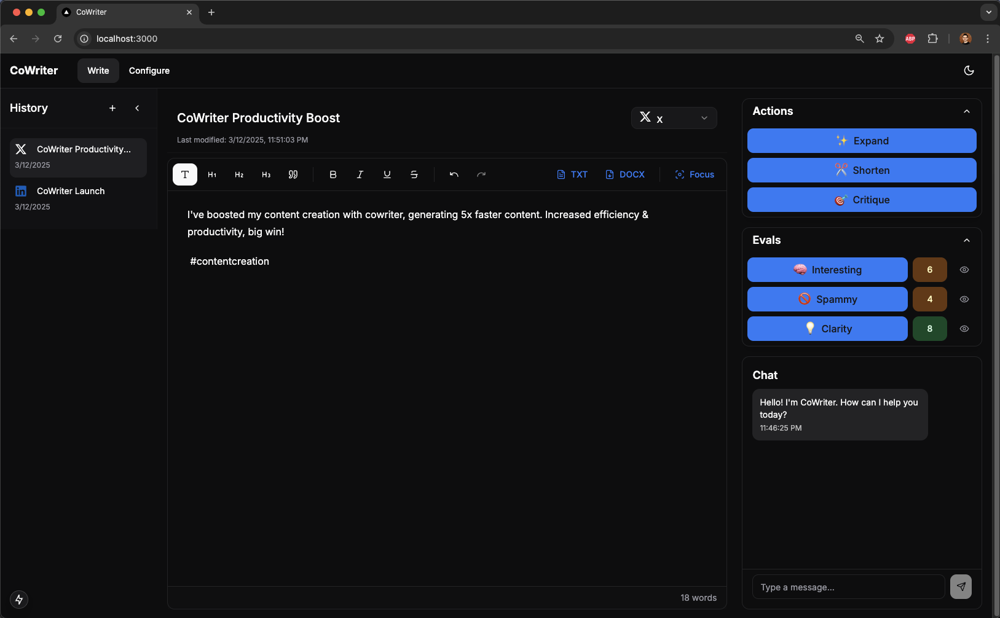

# CoWriter

CoWriter is an AI-powered writing assistant that helps you improve your writing through various actions like expanding, shortening, and critiquing text. It provides an intuitive interface for real-time writing enhancement and content creation.

## Screenshots


*The main CoWriter interface with AI-powered writing assistance*

## Features

- **Rich Text Editor**: Full-featured editor with formatting options (bold, italic, underline, headings)
- **Document History**: Track and manage your document history with timestamps
- **Multiple Document Types**: Support for various content types including Blog, Essay, LinkedIn, X (Twitter), Threads, Reddit, Email, and Newsletter
- **AI Actions**:
  - **Expand**: Elaborate on your ideas with AI-powered suggestions
  - **Shorten**: Make your writing more concise and impactful
  - **Critique**: Get constructive feedback on your writing
  - **Custom Actions**: Define your own actions to help you write, e.g. Add Facts, Add Quotes, etc.
- **Text Evaluation**:
  - **Interesting**: Score how engaging your content is
  - **Spammy**: Check if your content appears spammy
  - **Clarity**: Evaluate how clear and understandable your writing is
- **Interactive Chat**: Engage in a conversation about your text with the AI assistant
- **Export Options**: Export your content as TXT or DOCX files
- **Theme Support**: Light and dark mode for comfortable writing in any environment
- **Modern UI**: Clean and intuitive interface built with Next.js
- **Flexible AI Backend**: Support for both OpenAI and Llama models

## Project Structure

- `/backend` - FastAPI backend service
  - Python-based API with FastAPI
  - Support for OpenAI and Llama.cpp models
  - PostgreSQL database for storing user data, documents, and preferences
  - Type-safe with mypy
  - Formatted with black and isort
  - Linted with flake8
- `/cowriter` - Next.js frontend application
  - Modern React with TypeScript
  - Beautiful UI with Tailwind CSS
  - Real-time editing with Tiptap
  - ESLint and Prettier for code quality

## Prerequisites

- Node.js 18+ for the frontend
- Python 3.9+ for the backend
- Poetry (Python package manager)
- npm or yarn
- PostgreSQL (for production use)

## Quick Start

1. Clone the repository:
   ```bash
   git clone https://github.com/yourusername/cowriter.git
   cd cowriter
   ```

2. Run the setup script:
   ```bash
   ./setup.sh
   ```
   This will:
   - Check for required dependencies
   - Install all dependencies for both frontend and backend
   - Set up development tools (linters, formatters)
   - Configure pre-commit hooks

3. (Optional) Configure environment:
   If you want to use OpenAI's API or customize the backend settings:
   ```bash
   cp backend/.env.example backend/.env
   ```
   Then edit `backend/.env` to add your OpenAI API key and customize other settings.
   The application will work with default settings if no environment file is present.

4. Start the services:
   ```bash
   ./run.sh
   ```
   This will:
   - Start the backend service (FastAPI)
   - Wait for backend health check
   - Start the frontend service (Next.js)
   - Monitor both services

   Access the application at:
   - Frontend: http://localhost:3000
   - Backend API: http://localhost:8000
   - API Documentation: http://localhost:8000/docs

## Development

For development work, you'll want to run the services separately with full development dependencies:

### Backend
```bash
cd backend
poetry install  # Includes development dependencies
poetry shell
uvicorn app.main:app --reload --port 8000
```

### Frontend
```bash
cd cowriter
npm install  # Includes development dependencies
npm run dev
```

### Code Quality Tools

Backend:
```bash
cd backend
poetry run black .  # Format code
poetry run isort .  # Sort imports
poetry run flake8  # Lint code
poetry run mypy app/  # Type check
```

Frontend:
```bash
cd cowriter
npm run lint  # Run ESLint
npm run format  # Run Prettier
npm run type-check  # Run TypeScript checks
```

## API Documentation

When the backend is running, you can access:
- Swagger UI: http://localhost:8000/docs
- ReDoc: http://localhost:8000/redoc


## Contributing

Contributions are welcome! Please feel free to submit a Pull Request.

1. Fork the repository
2. Create your feature branch (`git checkout -b feature/AmazingFeature`)
3. Commit your changes (`git commit -m 'Add some AmazingFeature'`)
4. Push to the branch (`git push origin feature/AmazingFeature`)
5. Open a Pull Request

## License

This project is licensed under the MIT License - see the [LICENSE](LICENSE) file for details.

## Acknowledgments

- Built with [Next.js](https://nextjs.org/)
- Powered by [FastAPI](https://fastapi.tiangolo.com/)
- Rich text editing with [Tiptap](https://tiptap.dev/)